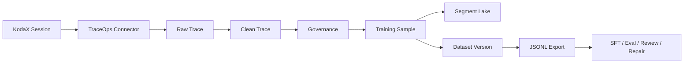
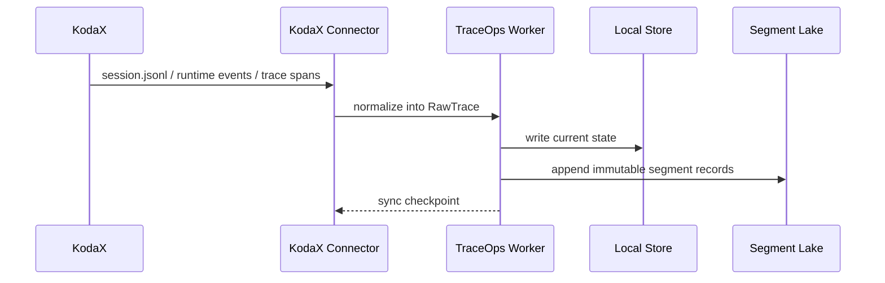
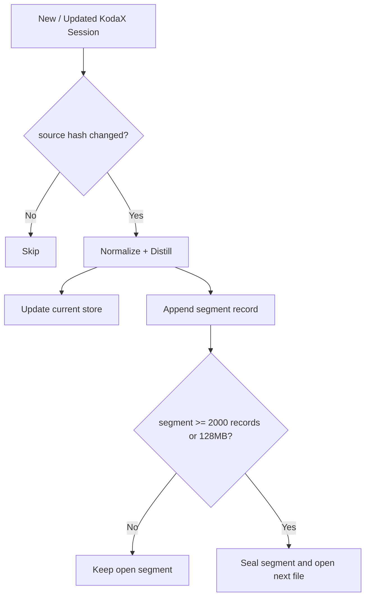

# TraceOps

TraceOps 是 KodaX 产品矩阵里的 **Agent 任务数据沉淀与 SFT 数据集生成系统**。

它的核心目标很简单：把 KodaX 在真实工作中产生的 session 数据自动接入，整理成可治理、可追溯、可导出的训练数据，最后输出可用于 SFT 的 JSONL 数据集。

> KodaX 负责完成任务，TraceOps 负责把这些真实任务沉淀成可训练的数据资产。

## 在线体验

- Vercel 前端预览：https://traceops-kodax.vercel.app
- GitHub 仓库：https://github.com/poppersamhar/TraceOps

线上版本默认运行在 **Demo Mode**：它不会读取访问者本机的 KodaX 数据，而是内置一组演示 session、样本、数据集和导出文件，方便同事快速理解产品流程。

真实接入 KodaX session、生成真实 SFT 数据集，需要在本地运行 worker。

## 产品定位

KodaX 产品矩阵目前是三层关系：

- **KodaX CLI**：更懂企业的软件设施、代码工程、DevOps、软件流程。
- **KodaX Space**：更懂企业员工的本地执行环境、文件、浏览器、IDE、账号和桌面任务。
- **AgentOS**：更懂企业本身，负责组织、项目、审批、记忆、Skill、Connector 和上层调度。

TraceOps 先从 **KodaX-first** 切入：优先接入 KodaX CLI / KodaX runtime 产生的完整 session 数据，把它们转化成训练数据资产。后续再接入 Space 和 AgentOS。

## 它有什么用

TraceOps 解决的是 Agent 产品持续进化里的数据问题：

- 自动收集 KodaX session，不再依赖人工复制对话。
- 把原始 session 还原成 Raw Trace，保留时间线、工具调用、运行上下文和证据。
- 清洗、脱敏、压缩上下文，生成更适合训练的数据样本。
- 标记风险、证据缺口、Review 状态，避免直接把脏数据送去训练。
- 固化数据集版本，支持审计、回滚、复盘和交付。
- 导出 SFT / Eval / Review / Repair / TraceOps JSONL。
- 按分片写入 Segment Lake，适合长期增量积累数据。

## 谁会用

- **KodaX 产品团队**：查看真实任务是否能沉淀为产品能力。
- **AI / 训练团队**：导出可用于 SFT、评测和修复的数据集。
- **数据治理团队**：审核风险、脱敏、证据和导出记录。
- **工程团队**：接入 KodaX session 规格，维护数据链路和存储。
- **管理者 / 项目负责人**：理解 Agent 在企业任务中的真实执行质量。

## 产品主流程

TraceOps 的前端现在围绕两个最重要的问题展开：

1. **数据接入**：KodaX session 是否已经被正确接入？
2. **数据输出**：当前是否能导出可用于 SFT 的 JSONL？

中间的 Raw、Clean、Governance、Dataset 都是自动转换和治理过程。



## 数据怎么进来

本地真实模式下，TraceOps 会读取 KodaX session 目录：

```text
~/.kodax/sessions
```

KodaX session 会被转换成 TraceOps 内部结构：

- `RawTrace`：一次完整任务会话。
- `RawTraceEvent`：消息、工具调用、工具结果、runtime event、span 等事件。
- `RawEvidence`：文件、命令、工具结果、检查结果等证据。
- `RawTraceRevision`：同一 session 的版本和 source hash。

接入时会做增量判断：已经导入且内容没有变化的 session 会跳过；发生变化的 session 会更新。



## 中间怎么处理

TraceOps 不会把原始 session 直接当训练数据。它会经过几层处理：

1. **Raw Trace 还原**：保留原始任务时间线、工具调用、运行上下文。
2. **Evidence 归因**：把工具结果、文件、命令、检查结果挂到样本上。
3. **Clean Trace 清洗**：移除不适合训练的内容，脱敏本地路径、凭据、邮箱、localhost 等。
4. **治理与 Review**：判断风险等级、证据缺口、是否需要人工审核。
5. **Candidate Sample**：生成 SFT / Eval / Repair / Review 等不同用途样本。
6. **Dataset Version**：把通过治理的样本固化成一个可追踪的数据集版本。
7. **Export**：导出给训练或评测系统使用。

## 数据怎么输出

TraceOps 当前支持这些导出格式：

- `fine_tune_jsonl`：用于 SFT 的 messages JSONL。
- `eval_jsonl`：用于评测集。
- `review_jsonl`：用于人工 Review。
- `repair_jsonl`：用于修复坏样本或补 evidence。
- `traceops_jsonl`：保留 TraceOps 元数据的完整样本格式。

SFT 导出示例：

```jsonl
{"messages":[{"role":"system","content":"You are KodaX, an enterprise coding agent."},{"role":"user","content":"将 KodaX session 数据整理为 SFT 训练样本。"},{"role":"assistant","content":"TraceOps 已生成可导出的 SFT JSONL 数据。"}],"metadata":{"sample_id":"sample-demo-sft-001","trace_id":"demo-trace-kodax-session-001","project_key":"kodax-product-matrix","quality_score":94}}
```

## Segment Lake

TraceOps 会把处理后的核心数据写入本地分片存储，避免每次都重新处理全部历史数据。

默认规则：

- 每个分片最多 2000 条记录。
- 或最多 128MB。
- 超过后创建下一份分片。

当前分片流：

- `raw_trace`
- `clean_trace`
- `training_sample`
- `dataset_version`

这意味着数据可以长期增量积累：新的 KodaX session 进入后，只处理新增和变化部分，并写入新的 segment。



## 代码结构

```text
TraceOps/
  apps/
    web/                       # TraceOps 产品界面
    worker/                    # session 同步、清洗、治理、导出 API
  packages/
    kodax-connector/           # KodaX session / runtime / trace span 适配器
    trace-core/                # Trace / Event / Evidence / Dataset 数据模型
    governance/                # 风险识别、脱敏、治理策略
    distiller/                 # Raw -> Clean -> Candidate
    exporters/                 # JSONL / eval / fine-tuning 格式导出
  docs/                        # 产品与接入设计文档
  .traceops/                   # 本地运行数据，不提交到 Git
```

## 本地运行真实链路

安装依赖：

```bash
npm install
```

启动前端和 worker：

```bash
npm run dev
```

打开：

```text
http://localhost:5173/
```

真实数据会写入：

```text
.traceops/store.json
.traceops/lake/
```

## 构建与测试

```bash
npm run build
npm test
```

Vercel 部署使用 Demo Mode：

```bash
VITE_TRACEOPS_DEMO=true npm run build
```

## 当前完成度

已完成：

- KodaX session 扫描与导入。
- Raw Trace / Timeline / Evidence 数据模型。
- Clean Trace 与训练样本生成。
- 风险识别、脱敏、Review、Repair。
- Dataset Version 固化。
- JSONL 导出。
- Segment Lake 分片存储。
- 存储健康检查、快照、恢复。
- KodaX feedback package 与 writeback。
- 任务编排、发布清单、训练 handoff、闭环监控的产品骨架。
- Vercel Demo Mode，可直接体验数据接入和导出。

仍在后续演进：

- 接入真实远端对象存储 / 数据仓库。
- 接入真实训练平台 API。
- 更完整的多租户权限和组织级审批。
- Space / AgentOS 数据源接入。
- 大规模数据质量报表和训练效果回流分析。

## 安全与治理

- `.traceops/` 是本地运行数据，默认不提交。
- 原始 session 不默认作为训练数据。
- 高风险、缺 evidence、未审核样本会被阻断或进入 Review。
- 导出动作会记录 export run，支持后续审计。
- Demo Mode 只包含演示数据，不包含真实 KodaX session。

## License

TraceOps is open source under the [MIT License](./LICENSE).

## 一句话总结

TraceOps 是 KodaX 的数据沉淀层：它把真实 Agent 工作过程变成可治理、可追溯、可导出的训练数据集，让产品能够从真实任务中持续自我进化。
