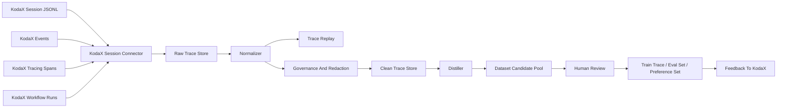

# TraceOps KodaX-first 产品与技术设计

> 用途：作为 TraceOps 从 KodaX 切入建设的上下文文档。它面向后续产品设计、数据模型、接口设计、原型和工程实现。
>
> 背景：KodaX 已经具备完整产品形态，并且会保留较完整的 session / lineage / artifact / workflow / tracing 上下文。因此 TraceOps 第一阶段应先从 KodaX 自动接收完整 session 数据，整理、治理、蒸馏并沉淀为可回放、可复盘、可训练的数据资产。AgentOS 的上层协同链路可以在第二阶段接入。

## 0. 核心结论

TraceOps 第一版不要先从 AgentOS 的大闭环做起，而应从 KodaX 的真实 session 数据做起。

原因是 KodaX 现在已经天然产生 TraceOps 最需要的三类材料：

1. `session / lineage`：完整对话、分支、压缩、回退、当前 active path。
2. `artifactLedger`：文件、命令、检查结果、决策、图片输入等证据链。
3. `events / spans / workflow snapshots`：工具调用、模型调用、子 agent、workflow 进度、错误与重试。

所以 TraceOps 的第一性定位应该是：

> KodaX 真实任务 session 的接收、回放、清洗、评价、蒸馏和训练数据生产系统。

不是普通日志系统，不是监控系统，也不是单纯的 trace viewer。

## 1. 为什么先从 KodaX 切入

KodaX CLI 是更懂企业软件设施、运维、软件流程和代码工程的执行入口。它已经在真实任务中产生高密度的行为数据：用户目标、模型思考、工具调用、文件读写、命令执行、测试反馈、失败修复、压缩摘要、分支回退和最终成果。

TraceOps 如果先从 KodaX 切入，有三个好处：

- 数据真实：直接来自 agent 执行现场，不是人为补录。
- 结构稳定：KodaX 已经有 session SDK、JSONL 存储、lineage、artifact ledger、workflow process、tracing processor。
- 闭环短：第一版不需要等 AgentOS / Space / PAT 全部建完，就可以先完成“采集 -> 回放 -> 清洗 -> 候选训练数据”的核心链路。

因此第一阶段的产品判断是：

> KodaX 是 TraceOps 的第一个数据源和第一条产品主线；AgentOS 是后续组织级治理和协同入口。

## 2. KodaX 当前可对接的数据结构

以下是基于 KodaX 代码结构观察到的可接入面。

### 2.1 持久化 Session

KodaX 的 session 默认存储在：

```text
~/.kodax/sessions/<projectKey>/<sessionId>.jsonl
```

旧版本可能还有平铺文件，但当前设计已经是按项目目录组织。公开 SDK 子路径是：

```ts
import {
  listSessions,
  loadSession,
  loadFullTranscript,
  watchSessions,
} from '@kodax-ai/kodax/session';
```

关键语义：

| KodaX API / 字段 | 对 TraceOps 的意义 |
|---|---|
| `listSessions()` | TraceOps 的 Session Inbox，可发现新 session、按项目和 scope 归档 |
| `loadSession(id)` | 只代表 active model context，适合继续对话，不适合作完整回放 |
| `loadFullTranscript(id)` | TraceOps 第一版最重要的读取入口，返回 append-order scrollback |
| `watchSessions()` | 用于自动接收新 session 或 session 变化 |
| `scope: 'user'` | 用户主 session |
| `scope: 'managed-task-worker'` | 子任务 / worker session，TraceOps 需要纳入完整链路 |
| `scope: 'all'` | TraceOps 后台采集应使用的范围 |

重要边界：

> TraceOps 做完整链路回放时，优先使用 `loadFullTranscript()`，不能只用 `loadSession()`。

### 2.2 `KodaXSessionData`

KodaX 的核心 session 数据大致包含：

```ts
interface KodaXSessionData {
  messages: KodaXMessage[];
  title: string;
  gitRoot: string;
  tag?: string;
  runtimeInfo?: KodaXSessionRuntimeInfo;
  scope?: 'user' | 'managed-task-worker';
  uiHistory?: KodaXSessionUiHistoryItem[];
  errorMetadata?: SessionErrorMetadata;
  extensionState?: KodaXExtensionSessionState;
  extensionRecords?: KodaXExtensionSessionRecord[];
  lineage?: KodaXSessionLineage;
  artifactLedger?: KodaXSessionArtifactLedgerEntry[];
}
```

TraceOps 的解释方式：

| 字段 | TraceOps 使用方式 |
|---|---|
| `messages` | active path 的模型上下文，不等于完整历史 |
| `lineage` | session 的权威历史结构，含分支、压缩、回退、goal |
| `artifactLedger` | 工具、文件、命令、决策和检查结果的证据链 |
| `runtimeInfo` | 任务发生时的项目、模型、权限、运行端、profile 快照 |
| `uiHistory` | 可选 UI 回放缓存，不能当作 canonical 数据源 |
| `extensionRecords` | Skill / MCP / 插件 / 宿主侧扩展事件的补充来源 |
| `errorMetadata` | 失败样本、修复样本、异常退出样本的重要标签来源 |

### 2.3 `lineage`

KodaX 的 `lineage` 是 TraceOps 回放能力的核心。

```ts
interface KodaXSessionLineage {
  version: 2;
  activeEntryId: string | null;
  entries: KodaXSessionEntry[];
}
```

主要 entry 类型：

| Entry 类型 | TraceOps 解释 |
|---|---|
| `message` | 用户、助手、系统消息 |
| `compaction` | 上下文压缩，保留摘要、token 前后变化、memory seed |
| `branch_summary` | 分支回退或 fork 后的分支摘要 |
| `label` | session 内标注 |
| `archive_marker` | 历史 island 被归档的标记 |
| `goal` | 用户设置的目标状态变化 |

TraceOps 的设计含义：

- 不能把 session 理解成线性聊天记录。
- 必须把它理解成一棵可分支、可回退、可压缩的任务过程树。
- `activeEntryId` 决定当前有效上下文。
- `loadFullTranscript()` 可以把 active 与 off-path 历史合并成 append-order scrollback。

### 2.4 `artifactLedger`

KodaX 的 `artifactLedger` 是 TraceOps 从“聊天记录”升级为“任务证据链”的关键。

主要类型包括：

```text
file_read
file_modified
file_created
file_deleted
path_scope
search_scope
command_scope
check_result
decision
image_input
tombstone
```

TraceOps 应将这些映射为：

| KodaX ledger | TraceOps 对象 |
|---|---|
| 文件读写 | Artifact Evidence / Code Evidence |
| 搜索范围 | Context Acquisition Evidence |
| 命令范围 | Command Execution Evidence |
| 检查结果 | Evaluation Signal |
| 决策记录 | Reasoning / Planning Evidence |
| 图片输入 | Multimodal Input Evidence |
| tombstone | 数据被废弃、删除或不可再用的状态 |

这部分会支撑训练样本里的工具调用、代码修改、测试修复、错误恢复和证据溯源。

### 2.5 `runtimeInfo`

`runtimeInfo` 是 TraceOps 的 Context Snapshot 来源之一。

典型字段：

```text
canonicalRepoRoot
workspaceRoot
executionCwd
branch
workspaceKind
surface
profileId
profileVersion
provider
model
reasoningMode
permissionMode
agentMode
```

TraceOps 应把它保存为每条 Trace 的运行上下文：

- 这个任务在哪个项目发生？
- 当时在哪个分支？
- 是 CLI、Space 还是其他宿主？
- 使用了哪个 profile？
- 使用了哪个 provider / model？
- 当时权限策略是什么？
- 是单 agent、managed task，还是 workflow？

这些信息决定样本能否复现、能否训练、能否跨项目复用。

### 2.6 `KodaXEvents`

KodaX 的 `KodaXEvents` 是实时事件接入面。

关键事件包括：

| 事件 | TraceOps 用途 |
|---|---|
| `onSessionStart` | 创建 Trace / Session Source |
| `onTextDelta` | 实时助手输出 |
| `onThinkingDelta` / `onThinkingEnd` | 思考链路或可显示思考摘要 |
| `onToolUseStart` | 工具调用开始 |
| `onToolResult` | 工具调用结果 |
| `onToolProgress` | 长任务进度 |
| `onIterationStart` / `onIterationEnd` | agent 轮次、token、usage |
| `onCompactStart` / `onCompactedMessages` | 上下文压缩事件 |
| `onRetry` / `onRetryAfter` | 重试、限流、恢复事件 |
| `onSidecarMessage` | sidecar verifier 纠偏或阻断 |
| `onTodoUpdate` | 计划 / todo 状态变化 |
| `onWorkflowProcessEvent` | workflow 进度快照 |
| `onWorkflowAgentDigest` | 子 agent 结果摘要 |
| `onError` / `onComplete` | 任务终态 |

KodaXEvents 的 meta 已经可以携带：

```text
sessionId
agentProfile
childAgentId
childAgentName
parentToolId
workflowCorrelation
```

这让 TraceOps 可以把父 session、子 agent、工具调用和 workflow run 对齐。

### 2.7 Tracing Processor

KodaX Agent 层已经有 tracing 基础设施：

```ts
addTracingProcessor(processor)
setTracingProcessors(processors)
shutdownTracing()
```

span 类型包括：

| Span 类型 | TraceOps 用途 |
|---|---|
| `agent` | agent 轮次、模型、工具范围 |
| `generation` | LLM 调用、token、cost、finish reason |
| `tool_call` | 工具调用、输入输出预览、状态 |
| `handoff` | agent 之间交接 |
| `compaction` | 压缩策略和压缩效果 |
| `guardrail` | 权限、合规、阻断、改写 |
| `evidence` | 证据获取 |
| `fanout` | 并行子 agent |
| `stop-hook` | sidecar / verifier 的 accept、revise、abort |

KodaX 已经提供 `FileTracingProcessor`，可写入：

```text
.kodax/.traces/<traceId>.jsonl
```

TraceOps 后续可以实现一个 `TraceOpsTracingProcessor`，把 span 实时写入 TraceOps。第一版可以先读取 KodaX session 文件，tracing 文件作为增强。

### 2.8 Workflow Process / Run Graph

KodaX workflow 已有两类可用材料：

1. `WorkflowProcessSnapshot`：面向宿主/UI 的进度快照。
2. `WorkflowEvent`：append-only run graph event stream。

WorkflowProcessSnapshot 包含：

```text
runId
workflowName
status
goal
source
hostMetadata
items
counts
progress
tokens
latestMessage
resultSummary
artifacts
```

WorkflowEvent 包含：

```text
workflow_started
phase_started
agent_spawned
agent_message_sent
agent_completed
agent_failed
agent_summary_updated
artifact_written
synthesis_completed
workflow_completed
workflow_failed
```

TraceOps 应将 workflow 解释为一个更高层的任务图：

- workflow run = 一条 Trace 内的 orchestration layer。
- child agent = Trace 内的子执行节点。
- phase = 任务阶段。
- artifact = 阶段产物。
- hostMetadata = session / surface / profile 归因入口。

## 3. TraceOps 对 KodaX 的对象映射

| TraceOps 对象 | KodaX 来源 | 说明 |
|---|---|---|
| `Trace` | `sessionId` + `projectKey` + optional workflow run | 一次可回放任务链路 |
| `TraceSource` | `runtimeInfo.surface/profileId/provider/model` | 任务来源和运行环境 |
| `SessionSource` | `KodaXSessionData` | KodaX 原始 session 快照 |
| `TimelineEvent` | `loadFullTranscript().transcriptEntries` | append-order 时间线 |
| `MessageEvent` | `KodaXMessage` | 用户/助手/系统消息 |
| `ToolEvent` | `tool_use` / `tool_result` / `KodaXEvents` / span | 工具调用链路 |
| `Evidence` | `artifactLedger` | 文件、命令、检查、决策证据 |
| `ExecutionSpan` | tracing span | agent / generation / tool / guardrail / compaction |
| `WorkflowNode` | `WorkflowProcessItem` / `WorkflowEvent` | workflow 阶段、子 agent、artifact |
| `ContextSnapshot` | `runtimeInfo` + `extensionState` + policy | 当时上下文、权限和运行配置 |
| `QualitySignal` | error、check_result、sidecar、verdict、用户接受 | 质量评分和训练价值 |
| `DatasetCandidate` | Clean Trace + labels | 可进入训练 / 评测 / 偏好数据池 |

## 4. TraceOps 主链路



这条链路中，TraceOps 至少要区分三层数据：

| 数据层 | 说明 | 是否可训练 |
|---|---|---|
| Raw Trace | 原始 session、原始工具输入输出、原始证据 | 不可直接训练 |
| Clean Trace | 清洗、脱敏、去噪、结构化后的过程数据 | 可用于分析和候选 |
| Train Trace | 授权、脱敏、有标签、有质量评分的数据 | 可进入训练/评测/偏好数据 |

## 5. 第一版产品形态

TraceOps 第一版建议先做成 KodaX Session 工作台，而不是直接做庞大的企业训练平台。

### 5.1 Session Inbox

自动接收 KodaX 产生的 session。

能力：

- 按项目、时间、profile、model、scope 展示 session。
- 标记 user session 和 managed-task-worker session。
- 识别失败、异常中断、重试多、工具调用多、文件修改多的高价值 session。
- 支持 watch 新 session 自动入库。

### 5.2 Trace Replay

把 KodaX session 还原为可阅读、可复盘的任务过程。

能力：

- 使用 `loadFullTranscript()` 展示 append-order 时间线。
- 展示 active path 与 off-path branch。
- 展示 compaction 前后摘要。
- 展示 tool use / tool result 卡片。
- 展示 artifact ledger 证据。
- 展示 runtimeInfo 和权限模式。
- 对 workflow 展示 phase、child agent、artifact、result summary。

### 5.3 Evidence Panel

把工具调用从“聊天附属物”升级为“证据链”。

能力：

- 文件读写列表。
- 命令执行和检查结果。
- 搜索范围。
- 决策记录。
- 图片输入。
- 失败和修复点。
- 与 message / sessionEntryId 对齐。

### 5.4 Clean Trace Workbench

将 Raw Trace 转化成 Clean Trace。

能力：

- 去除噪声事件。
- 合并连续的输出片段。
- 对工具输入输出做摘要。
- 对敏感路径、账号、密钥、客户信息做脱敏。
- 将失败、重试、修复、接受、拒绝标成结构化标签。
- 生成任务摘要、计划摘要、结果摘要和可复用经验。

### 5.5 Dataset Candidate Pool

将 Clean Trace 转化为训练候选池。

候选类型：

| 数据类型 | 来源 |
|---|---|
| SFT 样本 | 高质量用户目标 -> agent 完整解决路径 -> 最终结果 |
| Tool-use 样本 | tool_use / tool_result / artifactLedger |
| Planning 样本 | todo、workflow phase、child agent 拆解 |
| Repair 样本 | error -> retry / revise / fix -> success |
| Preference 样本 | branch、sidecar revise、用户接受/拒绝 |
| Eval 样本 | check_result、verification、final artifact |

### 5.6 Export Center

第一版只需要支持 JSONL 导出，后续再扩展 Parquet、OpenAI fine-tuning format、自定义 eval format。

每次导出必须记录：

- source trace ids。
- 清洗策略版本。
- 脱敏策略版本。
- 审批人。
- 用途。
- 导出时间。
- 可撤回状态。

## 6. KodaX-first 技术架构建议

### 6.1 P0：无侵入读取

第一阶段不要求改 KodaX 代码。

TraceOps 只做读取和整理：

1. 使用 `listSessions({ scope: 'all' })` 获取 session。
2. 使用 `loadFullTranscript(id)` 读取完整 scrollback。
3. 读取 `lineage`、`artifactLedger`、`runtimeInfo`、`extensionRecords`。
4. 生成 TraceOps 自己的 `trace_id`。
5. 将数据写入 Raw Trace Store。

建议 trace id 规则：

```text
trace_kodax_<projectKey>_<sessionId>
```

如果后续 KodaX 提供显式 trace id，则以显式 trace id 为准。

### 6.2 P1：实时事件接入

第二阶段实现 KodaX runtime adapter：

- 包装 `KodaXEvents`，把事件实时送入 TraceOps。
- 实现 `TraceOpsTracingProcessor`，接入 `addTracingProcessor()`。
- 从 `onWorkflowProcessEvent` 接收 workflow 快照。
- 使用 `sessionId`、`workflowCorrelation`、`childAgentId` 做归因。

这时 TraceOps 可以实时展示任务进度，而不是只做事后回放。

### 6.3 P2：KodaX 侧轻量标记

第三阶段可以考虑给 KodaX 增加少量显式归因字段，但不要重构 KodaX 的 session 体系。

建议方向：

- 在 session `tag` 或 `extensionRecords` 中写入 TraceOps trace id。
- workflow `hostMetadata` 写入 `traceOpsTraceId`、`sessionId`、`surface`。
- tracing span metadata 写入 `sessionId`。
- artifactLedger entry 尽量携带 `sessionEntryId`，方便和消息对齐。

### 6.4 P3：AgentOS 接入

当 KodaX-first 链路稳定后，再把 AgentOS 接入为上层治理和协同来源：

- PAT Agent：Space 与 AgentOS 之间的数据/任务转运。
- ProjectAgent：项目目标、任务拆解、群聊分发、进度回收。
- OrgAgent：企业级审批、Skill/Connector/企业记忆库治理、训练授权。

AgentOS 接入后，TraceOps 的 Trace 将从单个 KodaX session 扩展成：

```text
Project goal
  -> ProjectAgent plan
  -> PAT dispatch
  -> Space local execution
  -> KodaX session / worker sessions
  -> PAT result return
  -> ProjectAgent acceptance
  -> OrgAgent governance / memory / dataset approval
```

## 7. 建议数据模型

### 7.1 `Trace`

```ts
interface Trace {
  id: string;
  source: 'kodax';
  sourceSessionId: string;
  projectKey?: string;
  title: string;
  status: 'running' | 'completed' | 'failed' | 'cancelled' | 'unknown';
  createdAt?: string;
  updatedAt?: string;
  runtime: TraceRuntimeSnapshot;
  rawSensitivity: 'L0' | 'L1' | 'L2' | 'L3' | 'L4';
  governanceState: 'raw' | 'cleaning' | 'clean' | 'candidate' | 'approved' | 'rejected' | 'exported';
}
```

### 7.2 `TraceEvent`

```ts
interface TraceEvent {
  id: string;
  traceId: string;
  source: 'kodax_session' | 'kodax_event' | 'kodax_span' | 'kodax_workflow';
  sourceEntryId?: string;
  parentId?: string | null;
  occurredAt: string;
  type:
    | 'message'
    | 'compaction'
    | 'branch_summary'
    | 'goal'
    | 'tool_call'
    | 'tool_result'
    | 'artifact'
    | 'generation'
    | 'workflow'
    | 'error'
    | 'quality_signal';
  actor?: string;
  payload: unknown;
  active?: boolean;
  sensitivity?: 'L0' | 'L1' | 'L2' | 'L3' | 'L4';
}
```

### 7.3 `ArtifactEvidence`

```ts
interface ArtifactEvidence {
  id: string;
  traceId: string;
  sourceLedgerId: string;
  kind:
    | 'file_read'
    | 'file_modified'
    | 'file_created'
    | 'file_deleted'
    | 'path_scope'
    | 'search_scope'
    | 'command_scope'
    | 'check_result'
    | 'decision'
    | 'image_input'
    | 'tombstone';
  target: string;
  displayTarget?: string;
  summary?: string;
  sourceTool?: string;
  action?: string;
  sessionEntryId?: string;
  timestamp: string;
  metadata?: Record<string, unknown>;
}
```

### 7.4 `DatasetCandidate`

```ts
interface DatasetCandidate {
  id: string;
  traceId: string;
  candidateType: 'sft' | 'tool_use' | 'planning' | 'repair' | 'preference' | 'eval';
  qualityScore: number;
  riskLevel: 'L0' | 'L1' | 'L2' | 'L3' | 'L4';
  approvalState: 'pending' | 'approved' | 'rejected';
  inputSummary: string;
  outputSummary: string;
  labels: string[];
  sourceEventIds: string[];
  cleaningPolicyVersion: string;
  redactionPolicyVersion: string;
}
```

## 8. 样本蒸馏策略

TraceOps 不应该把完整 Raw Trace 直接变成训练数据，而应先蒸馏成几类结构化样本。

### 8.1 SFT

适合条件：

- 用户目标清晰。
- agent 完成结果被接受。
- 工具调用链路完整。
- 无高敏感数据，或已脱敏。

输出形态：

```text
instruction -> context summary -> response / final artifact summary
```

### 8.2 Tool-use

适合条件：

- 工具调用输入输出明确。
- artifactLedger 能证明工具调用结果。
- 工具调用不是偶然噪声。

输出形态：

```text
conversation prefix -> tool call -> tool result -> next action
```

### 8.3 Planning

适合条件：

- 有 todo / workflow phase / child agent 拆解。
- 拆解最终带来完成结果。

输出形态：

```text
goal -> plan -> task decomposition -> execution order
```

### 8.4 Repair

适合条件：

- 出现错误、失败检查、权限失败、测试失败或 sidecar revise。
- agent 后续修复成功。

输出形态：

```text
failed state -> diagnosis -> repair action -> passing evidence
```

### 8.5 Preference

适合条件：

- 出现分支、回退、修订、sidecar verdict、用户拒绝/接受。

输出形态：

```text
prompt -> rejected trajectory -> preferred trajectory -> reason
```

### 8.6 Evaluation

适合条件：

- 有 `check_result`、verification result、测试通过/失败、最终 artifact。

输出形态：

```text
task -> expected properties -> evaluation rubric -> pass/fail evidence
```

## 9. 治理与安全

KodaX session 可能包含源码、路径、命令输出、账号上下文、企业业务细节和本地文件信息。因此 TraceOps 必须默认把 Raw Trace 视为高敏数据。

基本原则：

- Raw Trace 默认不可训练。
- `uiHistory` 只能作为 UI replay hint，不作为权威训练来源。
- `messages / lineage / artifactLedger` 是 KodaX session 的主数据源。
- 训练数据必须经过脱敏、授权、评分和审批。
- 任何导出都必须记录来源 trace、清洗策略、审批状态和用途。
- 员工端侧敏感数据可以只上传摘要、哈希、指标或结构化标签。

风险等级建议：

| 等级 | 说明 | 默认处理 |
|---|---|---|
| L0 | 公开或无敏感信息 | 可进入通用样本 |
| L1 | 企业内部信息 | 只进入企业私有样本 |
| L2 | 项目受限信息 | 只在项目范围内回放和分析 |
| L3 | 端侧敏感、源码、客户信息、账号上下文 | 默认不出端或只出摘要 |
| L4 | 禁止训练或合规限制 | 只审计，不进记忆/评测/训练 |

## 10. MVP 优先级

### P0：KodaX Session Ingestion

目标：先跑通“自动接收 KodaX session -> 结构化入库 -> 可回放”。

范围：

- KodaX session 列表同步。
- `loadFullTranscript()` 导入。
- lineage 时间线解析。
- artifactLedger 证据解析。
- runtimeInfo 展示。
- Raw Trace Store。
- Trace Replay 页面或原型。

不做：

- 不先做 AgentOS 全链路。
- 不先做复杂训练平台。
- 不直接训练 Raw Trace。

### P1：Clean Trace 与质量评分

目标：把 Raw Trace 变成可复盘、可筛选、可进入候选池的 Clean Trace。

范围：

- 敏感信息识别和脱敏。
- 失败/修复/成功标签。
- 工具调用质量评分。
- 高价值 Trace 候选池。
- JSONL 导出。

### P2：Dataset Builder

目标：生产可控的训练、评测、偏好数据。

范围：

- SFT 数据集。
- Tool-use 数据集。
- Planning 数据集。
- Repair 数据集。
- Preference 数据集。
- Eval 数据集。
- 审批和导出记录。

### P3：AgentOS / Space 接入

目标：从单个 KodaX session 扩展到企业协同任务链路。

范围：

- PAT 与 Space 的任务/数据转运 trace。
- ProjectAgent 的项目拆解和进度回收 trace。
- OrgAgent 的审批、Skill、Connector、记忆和训练授权 trace。
- 企业级 Trace 总览和治理面板。

## 11. 推荐工程目录

如果从当前 TraceOps 工作区开始落工程，可以这样组织：

```text
TraceOps/
  docs/
    traceops-product-brief.md
    kodax-first-traceops-design.md
  apps/
    web/                       # TraceOps 产品界面
    worker/                    # session 同步、清洗、蒸馏任务
  packages/
    kodax-connector/           # KodaX session/events/tracing 适配器
    trace-core/                # Trace/Event/Evidence/Dataset 数据模型
    governance/                # 脱敏、授权、风险等级、审批状态
    distiller/                 # Raw -> Clean -> Candidate
    exporters/                 # JSONL / eval / fine-tuning 格式导出
```

第一批最好先做：

```text
packages/kodax-connector
packages/trace-core
apps/web
```

## 12. 需要避免的设计误区

1. 不要把 TraceOps 做成普通日志平台。
   - 普通日志回答“发生了什么”。
   - TraceOps 要回答“为什么这样做、怎么做、做得怎么样、下次如何做得更好”。

2. 不要只保存最终结果。
   - 训练和复盘最有价值的是过程：计划、工具、失败、修复、证据和选择。

3. 不要把 `uiHistory` 当权威数据。
   - KodaX 已明确 `messages / lineage` 才是 canonical。
   - `uiHistory` 是可选、裁剪过、用于 terminal replay 的缓存。

4. 不要只读取 `loadSession()`。
   - `loadSession()` 是 active model context。
   - TraceOps 回放需要 `loadFullTranscript()`。

5. 不要把 Raw Trace 直接喂给训练。
   - Raw Trace 包含大量敏感和噪声。
   - 必须经过 Clean Trace 和 Train Trace 两道门。

6. 不要一开始就绑定 AgentOS。
   - AgentOS 适合承担组织治理和协同入口。
   - TraceOps 的底层数据飞轮可以先从 KodaX 自己跑起来。

## 13. 一句话产品叙述

> TraceOps 从 KodaX 的真实执行 session 中自动接收完整上下文，把每一次软件工程任务转化为可回放的 Trace、可复盘的证据链、可治理的经验资产，以及可授权导出的训练数据。

