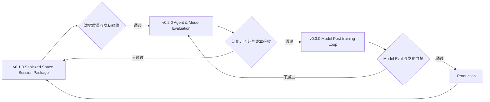

# TraceOps 产品版本路线

## 版本管理原则

TraceOps 用语义版本号管理正式产品边界：

- Minor 版本扩展一层完整产品能力，而不是简单累积页面数量。
- 当前版本只对外承诺已经进入正式范围的功能。
- 后续版本代码可以提前以“开发预览”存在，但不能计入当前版本完成度。
- 新版本可以复用并回归验证上一版本的能力，但必须保留上一版本的独立入口和构建产物。
- 只有满足版本验收标准，版本状态才能从 `planned` / `next` 变成 `current`。

后端通过以下接口提供同一份版本契约：

- `GET /api/platform/architecture`
- `GET /api/platform/releases`
- `GET /api/platform/releases/:version`

## v0.1.0 — Space Evaluation Collector

状态：当前正式版本。

目标：让数据提供同事在本机一键把 Space Session 整理成能够被 v0.2.0 评测体系消费的数据包。

正式范围：

- 自动检测 Space 与 KodaX SDK 共用的本地 Session 目录。
- 一键收集用户主 Session，排除 managed worker 和临时 Session。
- 保留成功与失败任务、完整事件图、分支、工具输入/结果、Evidence 与安全运行元信息。
- 删除 thinking，对结构化字段逐项脱敏并匿名化所有关联 ID。
- 生成 Evaluation Trace、Evaluation Case、Assertions、Grader 和 Replay 要求。
- 生成 `caseIndex` 与 `qualityReport`，作为 v0.2.0 Review 队列和导入验收的轻量入口。
- 执行完整性、隐私、Evidence、回放、运行归因、污染与去重质量门禁。
- 生成单个 `.json.gz` 数据包并由同事手动下载、发送。
- 默认作为 `update_evidence`；Validation 必须在 Harness 修改前冻结独立 Holdout。

明确排除：

- 多数据源管理、持续同步、Dataset Version、Diff、Review 和 Repair 工作台。
- Harness H0/H1 正式评测。
- Model Eval。
- SFT / 后训练 Provider。
- Model Release、Canary、Rollback 和线上反馈闭环。

版本验收：

1. 同事只需进入一个页面并点击一个主按钮即可完成收集与整理。
2. 采集器能识别 Space 默认与独立数据档，并且不读取浏览器 Cookie 或修改源文件。
3. 输出不包含原始工程路径、原始 Session ID、thinking 和已识别的敏感字段，同时保留评测需要的工具与 Evidence 结构。
4. 数据包有版本、Manifest、Trace、Case、Grader、质量结论和内容校验值，可被 v0.2.0 直接导入。
5. v0.1.0 入口、启动命令和构建产物在开发 v0.2.0 时继续保留。

核心交付物：`Evaluation-ready Space Trace Package`。

## v0.2.0 — Agent & Model Evaluation

状态：下一版本；当前代码只作为开发预览。

目标：在 v0.1.0 数据基础上，分别证明 Harness 和 Model 是否真正变强。

正式范围：

- v0.1.0 全部能力及回归保障。
- Evaluation Issue、Validation Case 和冻结 Benchmark Suite。
- 固定 Model / Runtime 的 Harness H0/H1 成对评测。
- 固定 Harness / Runtime / Benchmark 的 Model Snapshot 对照评测。
- Target Capability、Case Churn、泛化、OOD、历史回放和重复采样。
- 回归、成本、延迟、稳定性 Guardrail 和可审计 Verdict。
- 评测通过经验向训练数据候选晋升，但不在本版本内启动模型训练。

核心交付物：`Harness Verdict + Model Verdict`。

## v0.3.0 — Model Post-training Loop

状态：规划版本；这是三阶段里工程与产品风险最高的一部分。

目标：把已验证数据转化为新的 Model Snapshot，并形成训练、评测、发布、线上反馈闭环。

正式范围：

- v0.1.0 与 v0.2.0 全部能力及回归保障。
- Training Dataset、Manifest、Provider Handoff 和 Training Run。
- 训练任务状态、成本、数据版本和 Model Snapshot Lineage。
- 后训练前后独立 Model Eval。
- Model × Harness 组合评测与发布门禁。
- Model Registry、Deployment Handoff、Canary 和 Rollback。
- Production Signal 回流到新的 Trace、Benchmark 和训练数据候选。

核心交付物：`Validated Model Release + Production Feedback`。

## 晋级规则

版本晋级改变的是正式交付范围；开发预览能力不得绕过验收直接进入生产。
