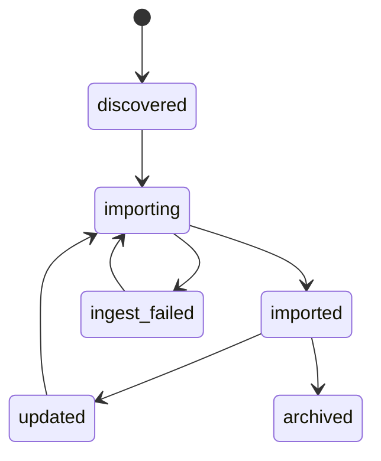
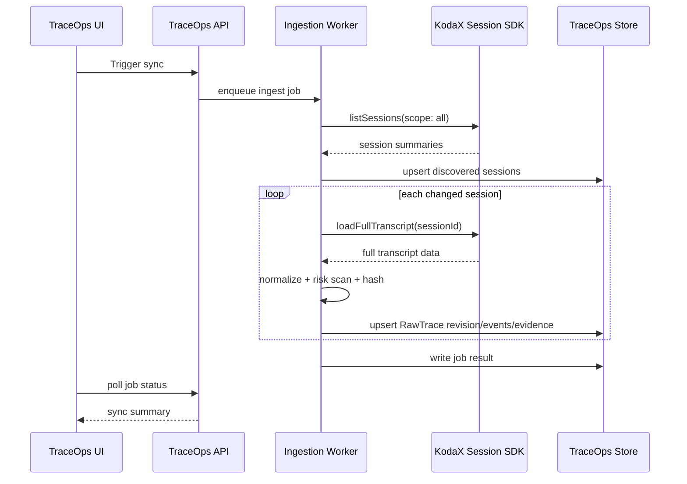

# Step 01：KodaX Session Ingestion 设计

> 所属主文档：[TraceOps KodaX-first 产品与技术设计](./kodax-first-traceops-design.md)
>
> 本文是 TraceOps 深入设计的第一步：先把 KodaX 产生的完整 session 自动接收进 TraceOps，并转换成可回放、可治理、可继续蒸馏的 Raw Trace。

## 1. 这一阶段要解决什么

TraceOps 的第一阶段不先做复杂训练平台，也不先做 AgentOS 协同闭环，而是先回答一个最关键的问题：

> KodaX 已经产生了完整 session，TraceOps 如何稳定、自动、可追溯地接收这些 session，并把它们组织成 Raw Trace？

这一步完成后，TraceOps 才有真实数据基础，后面的回放、清洗、质量评分、训练候选池才有对象可处理。

## 2. 产品目标

P0 的目标是建设一个 KodaX Session Inbox。

它需要做到：

- 自动发现 KodaX 新产生的 session。
- 能区分不同项目、不同 profile、不同运行端、不同 scope。
- 能读取完整 append-order transcript，而不是只读 active context。
- 能把 `lineage`、`artifactLedger`、`runtimeInfo`、`errorMetadata` 一起入库。
- 能生成 TraceOps 自己的 Raw Trace。
- 能在 TraceOps 中看到每条 Raw Trace 的基本状态、来源、风险和可回放性。

一句话：

> Session Inbox 是 TraceOps 的入口，它把 KodaX 的任务现场变成 TraceOps 的原始经验资产。

## 3. 不在这一阶段解决什么

为了保证第一阶段可落地，P0 暂时不做：

- 不做 AgentOS / PAT / ProjectAgent / OrgAgent 的完整链路。
- 不做训练数据自动生产。
- 不做复杂审批流。
- 不做实时多人协同看板。
- 不直接读取端侧敏感文件内容。
- 不把 Raw Trace 直接标记为可训练。
- 不要求修改 KodaX 主代码。

P0 的重点是：

> 先把 KodaX session 接进来，接完整，接稳定，接得可追溯。

## 4. KodaX 数据来源

### 4.1 Session SDK

TraceOps P0 优先使用 KodaX 已有 session SDK：

```ts
import {
  listSessions,
  loadFullTranscript,
  watchSessions,
} from '@kodax-ai/kodax/session';
```

读取策略：

| 需求 | 使用方式 |
|---|---|
| 首次同步历史 session | `listSessions({ scope: 'all' })` |
| 读取单条完整 session | `loadFullTranscript(sessionId)` |
| 后续自动发现变更 | `watchSessions(callback)` |
| 包含 worker session | `scope: 'all'` |
| 回放完整历史 | 只使用 `loadFullTranscript()` 作为主入口 |

注意：

> `loadSession()` 只代表 active model context，不适合作为 TraceOps 的完整回放来源。TraceOps P0 应默认使用 `loadFullTranscript()`。

### 4.2 Session 文件

KodaX 默认 session 文件布局：

```text
~/.kodax/sessions/<projectKey>/<sessionId>.jsonl
```

TraceOps 不应该把这个路径结构当作唯一长期契约，但 P0 可以把它作为调试和导入定位参考。

### 4.3 核心字段

P0 必须接收：

| KodaX 字段 | 是否必需 | 用途 |
|---|---:|---|
| `sessionId` | 是 | 源 session 唯一标识 |
| `title` | 是 | Trace 标题 |
| `gitRoot` | 是 | 项目归属 |
| `runtimeInfo` | 是 | 运行环境快照 |
| `lineage` | 是 | 回放、分支、压缩、active path |
| `transcriptEntries` | 是 | append-order 时间线 |
| `activeMessages` | 是 | 当前有效上下文 |
| `artifactLedger` | 是 | 证据链 |
| `uiHistory` | 否 | UI replay 辅助，不作为权威来源 |
| `errorMetadata` | 否 | 失败和异常标签 |
| `extensionRecords` | 否 | 扩展事件补充 |

## 5. TraceOps Raw Trace 生成规则

### 5.1 Trace ID

P0 建议 TraceOps 自己生成稳定 id：

```text
trace_kodax_<projectKey>_<sessionId>
```

如果 `projectKey` 不存在，则降级为：

```text
trace_kodax_unknown_<sessionId>
```

后续如果 KodaX 显式写入 `traceOpsTraceId`，再以 KodaX 显式字段为准。

### 5.2 幂等规则

同一条 KodaX session 可以被多次同步，因此必须幂等。

推荐唯一键：

```text
source = kodax
sourceSessionId = <sessionId>
projectKey = <projectKey | unknown>
```

同步策略：

| 情况 | 处理 |
|---|---|
| 第一次发现 session | 创建 Raw Trace |
| session 有新增 entry | 更新 Raw Trace revision |
| session 没变化 | 跳过 |
| session 读取失败 | 标记 ingest_failed |
| session 后续恢复可读 | 继续 ingest，不新建重复 Trace |

### 5.3 Revision

Raw Trace 应记录版本，避免覆盖历史。

建议字段：

```ts
interface RawTraceRevision {
  revisionId: string;
  traceId: string;
  sourceSessionId: string;
  importedAt: string;
  sourceMessageCount: number;
  sourceLineageEntryCount: number;
  sourceArtifactCount: number;
  sourceHash: string;
}
```

`sourceHash` 可以由以下内容计算：

```text
sessionId + activeEntryId + lineage entry ids + artifact ledger ids + error metadata
```

## 6. Ingestion 状态机

每条 session 在 TraceOps 中应有 ingestion 状态。



状态定义：

| 状态 | 含义 |
|---|---|
| `discovered` | 已从 KodaX 列表发现，但还未完整读取 |
| `importing` | 正在读取和转换 |
| `imported` | 已形成 Raw Trace |
| `updated` | 源 session 发生变化，等待重新导入 |
| `ingest_failed` | 读取或转换失败 |
| `archived` | 用户或系统归档，不再主动显示 |

## 7. Raw Trace 数据模型

### 7.1 `RawTrace`

```ts
interface RawTrace {
  id: string;
  source: 'kodax';
  sourceSessionId: string;
  projectKey?: string;
  title: string;
  status: 'running' | 'completed' | 'failed' | 'unknown';
  ingestionStatus:
    | 'discovered'
    | 'importing'
    | 'imported'
    | 'updated'
    | 'ingest_failed'
    | 'archived';
  createdAt?: string;
  importedAt: string;
  updatedAt: string;
  runtime: RawTraceRuntime;
  counts: RawTraceCounts;
  risk: RawTraceRisk;
  latestRevisionId: string;
}
```

### 7.2 `RawTraceRuntime`

```ts
interface RawTraceRuntime {
  canonicalRepoRoot?: string;
  workspaceRoot?: string;
  executionCwd?: string;
  branch?: string;
  workspaceKind?: 'detected' | 'managed';
  surface?: string;
  profileId?: string;
  profileVersion?: string;
  provider?: string;
  model?: string;
  reasoningMode?: string;
  permissionMode?: string;
  agentMode?: string;
  scope?: 'user' | 'managed-task-worker';
}
```

### 7.3 `RawTraceCounts`

```ts
interface RawTraceCounts {
  messages: number;
  activeMessages: number;
  lineageEntries: number;
  transcriptEntries: number;
  artifactLedgerEntries: number;
  toolUseEvents: number;
  toolResultEvents: number;
  compactions: number;
  branchSummaries: number;
  goalEvents: number;
}
```

### 7.4 `RawTraceRisk`

```ts
interface RawTraceRisk {
  level: 'L0' | 'L1' | 'L2' | 'L3' | 'L4';
  reasons: string[];
  containsSourceCodeHint: boolean;
  containsLocalPathHint: boolean;
  containsCredentialHint: boolean;
  containsCustomerDataHint: boolean;
  trainableByDefault: false;
}
```

P0 中 `trainableByDefault` 永远是 `false`。

## 8. Raw Trace Event 模型

TraceOps 不应只保存一个大 JSON blob，而应把 session 拆成事件。

### 8.1 `RawTraceEvent`

```ts
interface RawTraceEvent {
  id: string;
  traceId: string;
  source: 'kodax_session';
  sourceEntryId?: string;
  parentEntryId?: string | null;
  occurredAt: string;
  order: number;
  type:
    | 'message'
    | 'compaction'
    | 'branch_summary'
    | 'goal'
    | 'tool_use'
    | 'tool_result'
    | 'artifact'
    | 'error_metadata';
  role?: 'user' | 'assistant' | 'system';
  active?: boolean;
  payload: unknown;
  riskLevel?: 'L0' | 'L1' | 'L2' | 'L3' | 'L4';
}
```

### 8.2 事件来源映射

| KodaX 来源 | TraceOps event |
|---|---|
| `transcriptEntries[].type === 'message'` | `message` |
| message content block `tool_use` | `tool_use` |
| message content block `tool_result` | `tool_result` |
| `transcriptEntries[].type === 'compaction'` | `compaction` |
| `transcriptEntries[].type === 'branch_summary'` | `branch_summary` |
| lineage entry `goal` | `goal` |
| `artifactLedger[]` | `artifact` |
| `errorMetadata` | `error_metadata` |

## 9. 证据链模型

P0 应把 `artifactLedger` 单独解析成 Evidence，而不是只嵌在 Raw Trace JSON 中。

```ts
interface RawEvidence {
  id: string;
  traceId: string;
  source: 'kodax_artifact_ledger';
  sourceLedgerId: string;
  kind:
    | 'file_read'
    | 'file_modified'
    | 'file_created'
    | 'file_deleted'
    | 'path_scope'
    | 'search_scope'
    | 'command_scope'
    | 'check_result'
    | 'decision'
    | 'image_input'
    | 'tombstone';
  sourceTool?: string;
  action?: string;
  target: string;
  displayTarget?: string;
  summary?: string;
  sessionEntryId?: string;
  timestamp: string;
  metadata?: Record<string, unknown>;
  riskLevel: 'L0' | 'L1' | 'L2' | 'L3' | 'L4';
}
```

证据链的作用：

- 支撑 Trace Replay 的右侧证据面板。
- 支撑后续 Clean Trace 的去噪和摘要。
- 支撑训练候选样本的来源追溯。
- 支撑失败修复样本的验证证据。

## 10. Session Inbox 页面设计

P0 页面不追求复杂，但要能让用户确认“数据已经接进来了”。

### 10.1 列表字段

| 字段 | 说明 |
|---|---|
| 标题 | KodaX session title |
| 项目 | projectKey / gitRoot |
| 来源 | KodaX CLI / Space / unknown |
| Profile | profileId |
| Scope | user / managed-task-worker |
| 模型 | provider / model |
| 状态 | imported / failed / updated |
| 风险 | L0-L4 |
| 消息数 | transcriptEntries count |
| 证据数 | artifactLedger count |
| 最近更新时间 | updatedAt |

### 10.2 筛选

首批筛选：

- 项目。
- 来源 surface。
- profile。
- scope。
- 模型。
- ingestion 状态。
- 风险等级。
- 是否失败。
- 是否有文件修改。
- 是否有 check_result。
- 是否有 compaction。

### 10.3 重要提示

列表中需要明确展示：

> Raw Trace 默认不可训练。

这样可以从产品表达上避免“接进来就能训练”的误解。

## 11. Trace Replay 页面 P0

P0 的 Trace Replay 只需要做好基础回放。

### 11.1 主结构

```text
顶部：Trace 标题 / 来源 / 项目 / 风险 / ingestion 状态
左侧：事件时间线
中间：消息与工具调用详情
右侧：Evidence / Runtime / Lineage 信息
```

### 11.2 时间线

时间线展示：

- 用户消息。
- 助手消息。
- 工具调用。
- 工具结果。
- compaction。
- branch summary。
- goal 变化。
- error metadata。
- artifact evidence。

### 11.3 右侧面板

右侧面板分三组：

| 面板 | 内容 |
|---|---|
| Runtime | provider、model、profile、branch、permissionMode |
| Evidence | 文件、命令、检查、决策、图片 |
| Lineage | activeEntryId、entry count、branch / compaction 摘要 |

## 12. 风险识别 P0

P0 不需要完整 DLP，但需要基础风险识别。

建议规则：

| 风险信号 | 默认等级 |
|---|---|
| 出现本地绝对路径 | L2 |
| 出现源码文件修改 | L2 |
| 出现 `.env`、token、secret、key 字样 | L4 |
| 出现客户、合同、金额等业务敏感词 | L3 |
| 出现图片输入 | L2 |
| 出现账号、浏览器、connector 字样 | L3 |
| 无文件、无工具、普通公开文本 | L0/L1 |

P0 风险识别只用于提示，不用于最终训练授权。

## 13. 错误处理

### 13.1 读取失败

常见原因：

- session 文件损坏。
- session 正在写入。
- KodaX SDK 返回 null。
- 权限不足。
- projectKey 歧义。

处理：

- 不删除已有 Raw Trace。
- 写入 ingest error。
- 下次同步继续重试。
- 在 Inbox 中展示失败原因。

### 13.2 部分数据缺失

| 缺失内容 | 处理 |
|---|---|
| 无 `runtimeInfo` | 标记 runtime incomplete |
| 无 `artifactLedger` | 仍可导入，但证据为空 |
| 无 `lineage` | 降级为 messages-only trace |
| 无 `uiHistory` | 不影响导入 |
| 无 `createdAt` | 使用 importedAt |

## 14. P0 成功标准

P0 做完以后，应该能做到：

- 打开 TraceOps 后看到 KodaX 历史 session 列表。
- 新 KodaX session 产生后能自动进入 Inbox。
- 任意一条 session 可以打开 Trace Replay。
- Replay 能看到完整 append-order transcript。
- Replay 能看到 KodaX artifactLedger 证据链。
- Replay 能看到 runtimeInfo。
- Raw Trace 有 ingestion 状态和风险提示。
- 同一 session 多次同步不会产生重复 Trace。
- Raw Trace 不会被误标为可训练。

## 15. 下一步设计

Step 01 解决“接进来”。

下一步应该设计：

> Step 02：Trace Replay 与 Evidence Panel 的详细交互设计。

因为只有用户能把 KodaX session 清楚地回放出来，后面的清洗、评分、蒸馏和训练候选才有可信基础。

---

## 16. Step 01 的“完成”定义

如果只写到前面 1-15 节，它还只是 P0 的方向性设计。真正认为 Step 01 设计完成，需要同时具备以下 8 个部分：

| 设计部分 | 当前状态 | 说明 |
|---|---|---|
| 产品边界 | 已定义 | 只做 KodaX Session Ingestion，不做训练平台和 AgentOS 大闭环 |
| 用户角色 | 已定义 | 明确谁会使用 Session Inbox 和 Trace Replay |
| 页面信息架构 | 已定义 | 明确入口、列表、详情、状态和筛选 |
| 数据模型 | 已定义 | RawTrace、Revision、Event、Evidence、Job、Error |
| 同步机制 | 已定义 | 发现、导入、增量、幂等、重试 |
| API / 内部动作 | 已定义 | 前端与 worker 需要的读写动作 |
| 异常与治理 | 已定义 | 读取失败、部分缺失、敏感风险、不可训练默认值 |
| 验收标准 | 已定义 | 能判断 P0 是否真的做完 |

因此，本文从第 16 节开始补齐 Step 01 的完整设计规格。

## 17. 用户角色与使用场景

### 17.1 TraceOps 管理者

目标：

- 确认 KodaX session 是否已经被 TraceOps 接收。
- 观察不同项目的 Raw Trace 数量、失败情况和风险分布。
- 发现值得复盘或后续清洗的高价值任务。

核心动作：

- 打开 Session Inbox。
- 按项目、模型、profile、风险筛选。
- 查看导入失败原因。
- 对失败 session 发起重试。
- 将明显无价值的 Raw Trace 归档。

### 17.2 数据治理 / 模型数据负责人

目标：

- 判断 Raw Trace 是否具备后续清洗和训练候选价值。
- 识别敏感风险和不可训练风险。
- 检查证据链是否完整。

核心动作：

- 查看 Raw Trace 的风险等级。
- 打开 Trace Replay 检查任务过程。
- 查看 Evidence Panel。
- 标记“可进入清洗队列”或“仅审计”。

### 17.3 KodaX 产品 / 工程负责人

目标：

- 验证 KodaX 产生的数据是否足够支撑 TraceOps。
- 发现 session 数据结构缺口。
- 判断后续是否需要 KodaX 侧补事件或补字段。

核心动作：

- 查看单条 session 的 lineage、artifactLedger、runtimeInfo。
- 对比 KodaX 原始 session 与 TraceOps Raw Trace。
- 查看导入日志和字段缺失提示。

## 18. 信息架构

Step 01 只需要三个一级页面/区域。

```text
TraceOps
  ├─ Session Inbox
  │   ├─ Session 列表
  │   ├─ 同步状态
  │   ├─ 筛选与搜索
  │   └─ 批量动作
  ├─ Raw Trace Detail
  │   ├─ Trace Replay
  │   ├─ Evidence Panel
  │   ├─ Runtime Snapshot
  │   └─ Ingestion Diagnostics
  └─ Source Settings
      ├─ KodaX session source
      ├─ 同步范围
      ├─ 最近同步记录
      └─ 风险扫描策略
```

其中 `Source Settings` 第一版可以很轻，只要能表达：

- 当前读取的 KodaX sessions 来源。
- 最近一次同步时间。
- 当前是否启用自动监听。
- 最近失败数量。

## 19. Session Inbox 完整页面设计

### 19.1 页面目标

Session Inbox 的目标不是管理训练数据，而是回答：

> KodaX 产生的任务现场，TraceOps 是否已经接收、是否完整、是否值得下一步处理？

### 19.2 顶部概览

顶部放 5 个紧凑指标：

| 指标 | 含义 |
|---|---|
| Total Sessions | 已发现 KodaX session 总数 |
| Imported Raw Traces | 已成功导入 Raw Trace 数 |
| Updated Pending | 源 session 有变化，等待重新导入 |
| Import Failed | 导入失败数 |
| High Risk | L3/L4 Raw Trace 数 |

### 19.3 列表列定义

| 列 | 示例 | 说明 |
|---|---|---|
| Trace | `修复登录回调失败` | title + trace id 简写 |
| Project | `agent-os` | projectKey 或 gitRoot display name |
| Source | `KodaX CLI` | runtimeInfo.surface |
| Scope | `user` | user / managed-task-worker |
| Profile | `coder` | profileId |
| Model | `anthropic / claude...` | provider + model |
| Status | `Imported` | ingestionStatus |
| Risk | `L2` | 初始风险等级 |
| Evidence | `18` | artifactLedgerEntries |
| Updated | `2026-07-02 16:20` | TraceOps 更新时间 |

### 19.4 行状态

| 状态 | UI 表达 | 用户动作 |
|---|---|---|
| `discovered` | 灰色 `Discovered` | 可手动导入 |
| `importing` | 蓝色进度态 | 不可重复触发 |
| `imported` | 绿色 `Imported` | 可打开详情 |
| `updated` | 黄色 `Updated` | 可重新导入 |
| `ingest_failed` | 红色 `Failed` | 可查看错误、重试 |
| `archived` | 灰色弱化 | 可恢复 |

### 19.5 空状态

当没有 session：

```text
还没有接收到 KodaX session
TraceOps 会从 KodaX 的 session 历史中导入任务过程。你可以先运行一次 KodaX 任务，或检查 KodaX session source 设置。
```

按钮：

- `检查 KodaX 来源`
- `手动同步`

### 19.6 导入失败状态

失败行展开后显示：

- 错误类型。
- 错误时间。
- sessionId。
- projectKey。
- 最近一次成功 revision。
- 建议动作。

常见建议文案：

| 错误 | 建议 |
|---|---|
| session 正在写入 | 稍后自动重试 |
| SDK 返回 null | 检查 session 是否仍存在 |
| lineage 缺失 | 将以 messages-only 降级导入 |
| JSONL 损坏 | 保留错误记录，等待人工检查 |

## 20. Raw Trace Detail 完整页面设计

Raw Trace Detail 是 Step 01 的第二个核心页面。

### 20.1 页面目标

回答：

> 这条 KodaX session 在 TraceOps 中是否被完整还原？它包含哪些消息、工具、证据、运行环境和风险？

### 20.2 顶部摘要

顶部展示：

- Trace 标题。
- 来源：KodaX。
- 项目。
- sessionId。
- profile / model。
- ingestion status。
- risk level。
- `Raw Trace 默认不可训练` 提示。

### 20.3 布局

```text
┌──────────────────────────────────────────────────────────────┐
│ Header: title / project / model / risk / status               │
├───────────────┬─────────────────────────────┬────────────────┤
│ Timeline      │ Event Detail                 │ Side Panel     │
│               │                             │ Runtime        │
│ message       │ message text / tool input    │ Evidence       │
│ tool_use      │ tool result / compaction     │ Lineage        │
│ artifact      │ error metadata               │ Diagnostics    │
└───────────────┴─────────────────────────────┴────────────────┘
```

### 20.4 Timeline 事件分组

Timeline 默认按 append-order 展示，同时保留 active 标记。

事件视觉层级：

| 事件 | 展示方式 |
|---|---|
| user message | 左侧明显节点 |
| assistant message | 普通节点 |
| tool_use | 工具节点，显示工具名 |
| tool_result | 结果节点，显示成功/失败 |
| compaction | 压缩节点，弱化但可展开 |
| branch_summary | 分支节点，显示 off-path 摘要 |
| artifact | 证据节点，可跳转 Evidence |
| error_metadata | 错误节点，突出显示 |

### 20.5 Event Detail

点击 Timeline 节点后，中间区域展示完整详情。

不同事件展示重点：

| 事件 | Detail 内容 |
|---|---|
| message | role、content、active、sourceEntryId |
| tool_use | tool name、input preview、sourceEntryId |
| tool_result | result preview、是否错误、关联 tool_use id |
| compaction | summary、tokensBefore、tokensAfter、memorySeed |
| branch_summary | summary、fromId |
| artifact | kind、target、summary、metadata |
| error_metadata | lastError、consecutiveErrors、lastErrorTime |

### 20.6 Side Panel

右侧面板有四个 tab：

| Tab | 内容 |
|---|---|
| Runtime | runtimeInfo、scope、projectKey、branch |
| Evidence | artifactLedger 分组列表 |
| Lineage | activeEntryId、entry count、compaction count、branch count |
| Diagnostics | ingestion revision、hash、错误、字段缺失 |

## 21. Source Settings 设计

Step 01 的 Source Settings 用于确认 KodaX 接入状态。

### 21.1 设置项

| 设置 | P0 默认 |
|---|---|
| Source Type | KodaX local session SDK |
| Scope | all |
| Import archived sessions | false |
| Auto watch | true |
| Risk scan | basic |
| Raw Trace trainable | false |

### 21.2 同步动作

按钮：

- `手动同步`
- `重试失败`
- `暂停自动监听`
- `查看最近同步日志`

### 21.3 同步日志

日志字段：

| 字段 | 说明 |
|---|---|
| jobId | 同步任务 id |
| startedAt / finishedAt | 时间 |
| discovered | 发现数量 |
| imported | 导入数量 |
| skipped | 跳过数量 |
| failed | 失败数量 |
| durationMs | 耗时 |

## 22. Ingestion Worker 设计

### 22.1 Worker 职责

Ingestion Worker 负责：

- 发现 KodaX session。
- 判断是否需要导入。
- 调用 `loadFullTranscript()`。
- 转换 RawTrace / RawTraceEvent / RawEvidence。
- 执行基础风险扫描。
- 记录 revision 和错误。

### 22.2 同步流程



### 22.3 导入算法

```ts
async function syncKodaXSessions() {
  const summaries = await listSessions({ scope: 'all' });

  for (const summary of summaries) {
    const sourceKey = makeSourceKey(summary);
    const existing = await store.findRawTraceBySource(sourceKey);

    if (existing && !shouldRefresh(existing, summary)) {
      continue;
    }

    await store.markImporting(sourceKey);

    try {
      const full = await loadFullTranscript(summary.id);
      if (!full) {
        await store.markFailed(sourceKey, 'session_not_found');
        continue;
      }

      const normalized = normalizeKodaXSession(summary, full);
      const sourceHash = hashNormalizedSource(normalized);

      if (existing?.latestSourceHash === sourceHash) {
        await store.markImportedNoChange(existing.id);
        continue;
      }

      await store.upsertRawTrace(normalized, sourceHash);
    } catch (error) {
      await store.markFailed(sourceKey, String(error));
    }
  }
}
```

### 22.4 `shouldRefresh`

刷新判断：

- summary 的 msgCount 增加。
- session updatedAt 晚于 lastImportedAt。
- Raw Trace 状态为 `updated`。
- 上次导入失败。
- 手动强制重试。
- 没有 latestRevision。

如果无法判断 updatedAt，则保守使用 hash 比对。

## 23. 存储表设计

不限定具体数据库，但逻辑表建议如下。

### 23.1 `trace_sources`

| 字段 | 类型 | 说明 |
|---|---|---|
| id | string | source id |
| type | `kodax` | 来源类型 |
| displayName | string | 展示名 |
| enabled | boolean | 是否启用 |
| config | json | sessionsDir、scope 等 |
| lastSyncAt | datetime | 最近同步 |

### 23.2 `raw_traces`

| 字段 | 类型 | 说明 |
|---|---|---|
| id | string | TraceOps trace id |
| source | string | kodax |
| sourceSessionId | string | KodaX session id |
| projectKey | string | 项目 key |
| title | string | 标题 |
| status | string | running / completed / failed / unknown |
| ingestionStatus | string | 导入状态 |
| runtime | json | runtime snapshot |
| counts | json | 计数 |
| risk | json | 风险 |
| latestRevisionId | string | 最新 revision |
| latestSourceHash | string | 幂等 hash |
| createdAt | datetime | 创建时间 |
| importedAt | datetime | 导入时间 |
| updatedAt | datetime | 更新时间 |

唯一约束：

```text
unique(source, sourceSessionId, projectKey)
```

### 23.3 `raw_trace_revisions`

| 字段 | 类型 | 说明 |
|---|---|---|
| id | string | revision id |
| traceId | string | raw trace id |
| sourceHash | string | 源数据 hash |
| sourceMessageCount | number | message 数 |
| sourceLineageEntryCount | number | lineage 数 |
| sourceArtifactCount | number | evidence 数 |
| importedAt | datetime | 导入时间 |
| rawSnapshotRef | string | 原始快照引用 |

### 23.4 `raw_trace_events`

| 字段 | 类型 | 说明 |
|---|---|---|
| id | string | event id |
| traceId | string | raw trace id |
| revisionId | string | revision id |
| sourceEntryId | string | KodaX lineage entry id |
| parentEntryId | string | parent id |
| order | number | append-order 顺序 |
| occurredAt | datetime | 事件时间 |
| type | string | message / tool_use / artifact 等 |
| role | string | user / assistant / system |
| active | boolean | 是否在 active path |
| payload | json | 原始负载 |
| riskLevel | string | L0-L4 |

### 23.5 `raw_evidence`

| 字段 | 类型 | 说明 |
|---|---|---|
| id | string | evidence id |
| traceId | string | raw trace id |
| revisionId | string | revision id |
| sourceLedgerId | string | KodaX ledger id |
| kind | string | file_read 等 |
| target | string | 目标 |
| displayTarget | string | 展示目标 |
| summary | string | 摘要 |
| sessionEntryId | string | 关联 entry |
| metadata | json | 原始 metadata |
| riskLevel | string | L0-L4 |

### 23.6 `ingest_jobs`

| 字段 | 类型 | 说明 |
|---|---|---|
| id | string | job id |
| sourceId | string | source id |
| status | string | queued / running / succeeded / failed |
| mode | string | manual / watch / scheduled / retry |
| discovered | number | 发现数量 |
| imported | number | 导入数量 |
| skipped | number | 跳过数量 |
| failed | number | 失败数量 |
| startedAt | datetime | 开始 |
| finishedAt | datetime | 结束 |

### 23.7 `ingest_errors`

| 字段 | 类型 | 说明 |
|---|---|---|
| id | string | error id |
| jobId | string | job id |
| traceId | string | 可选 |
| sourceSessionId | string | KodaX session id |
| errorType | string | 错误类型 |
| message | string | 错误信息 |
| recoverable | boolean | 是否可重试 |
| occurredAt | datetime | 时间 |

## 24. API / 内部动作设计

Step 01 可以先用内部 API，不需要公开外部协议。

### 24.1 Source

```text
GET  /api/sources
GET  /api/sources/kodax/status
POST /api/sources/kodax/sync
POST /api/sources/kodax/pause-watch
POST /api/sources/kodax/resume-watch
```

### 24.2 Ingest Job

```text
GET  /api/ingest/jobs
GET  /api/ingest/jobs/:id
POST /api/ingest/jobs/:id/retry-failed
```

### 24.3 Raw Trace

```text
GET  /api/raw-traces
GET  /api/raw-traces/:id
GET  /api/raw-traces/:id/events
GET  /api/raw-traces/:id/evidence
GET  /api/raw-traces/:id/revisions
POST /api/raw-traces/:id/reimport
POST /api/raw-traces/:id/archive
POST /api/raw-traces/:id/restore
```

### 24.4 查询参数

`GET /api/raw-traces` 支持：

```text
projectKey
source
scope
profileId
provider
model
ingestionStatus
riskLevel
hasEvidence
hasFileModification
hasCheckResult
hasError
query
limit
cursor
```

## 25. Normalizer 设计

Normalizer 负责把 KodaX 的结构转为 TraceOps Raw Trace。

### 25.1 输入

```ts
interface KodaXFullSessionInput {
  summary: SessionSummary;
  full: FullTranscriptSessionData;
}
```

### 25.2 输出

```ts
interface NormalizedRawTraceBundle {
  trace: RawTrace;
  revision: RawTraceRevision;
  events: RawTraceEvent[];
  evidence: RawEvidence[];
  diagnostics: IngestionDiagnostic[];
}
```

### 25.3 关键规则

| 规则 | 说明 |
|---|---|
| transcript order | 使用 `transcriptEntries` 的顺序 |
| active | 继承 `transcriptEntries[].active` |
| occurredAt | 优先 entry timestamp，缺失时使用 importedAt |
| tool events | 从 message content block 中拆出 |
| artifact event | 从 artifactLedger 生成独立 evidence，也可生成 timeline event |
| risk | 对 message、tool payload、target、metadata 做基础扫描 |
| raw payload | P0 保留原始 payload，但只在受控权限下查看 |

## 26. 风险扫描详细规则

P0 的风险扫描是 heuristic，不作为最终合规判断。

### 26.1 输入范围

扫描：

- message text。
- tool input preview。
- tool result preview。
- artifact target / displayTarget。
- artifact summary。
- runtime paths。
- error message。

不扫描：

- 不主动读取文件内容。
- 不访问 connector 内容。
- 不展开外部数据库。

### 26.2 风险规则

| 规则 | 等级 | 示例 |
|---|---|---|
| secret pattern | L4 | `api_key`, `secret`, `token=`, `sk-` |
| credential file | L4 | `.env`, `.npmrc`, `.ssh`, `credentials` |
| local absolute path | L2 | `/Users/...`, `C:\...` |
| source mutation | L2 | `file_modified`, `file_created` |
| customer/business hint | L3 | 客户、合同、报价、发票、订单 |
| browser/account hint | L3 | cookie、登录、账号、浏览器 |
| image input | L2 | `image_input` |
| check failure | L1 | failed test, error stack |

### 26.3 Trace 风险聚合

Raw Trace 的风险等级取最高事件风险。

```ts
trace.risk.level = max(events.riskLevel, evidence.riskLevel)
```

同时记录 reasons：

```text
contains local absolute path
contains source code mutation
contains possible credential
```

## 27. 权限与可见性

P0 至少需要两级可见性：

| 角色 | 能力 |
|---|---|
| Admin / Owner | 看全部 Raw Trace、失败日志、风险原因 |
| Reviewer | 看列表、看非 L4 详情、提交复盘判断 |

L4 Raw Trace 默认：

- 列表可见。
- 详情内容默认折叠。
- 需要显式权限才能展开 payload。
- 不允许进入清洗队列，除非管理员降级风险或做脱敏策略。

## 28. 完整用户流

### 28.1 首次同步

```text
用户打开 TraceOps
  -> 进入 Source Settings
  -> 点击手动同步
  -> 系统发现 KodaX sessions
  -> 导入可读 session
  -> Session Inbox 展示导入结果
  -> 用户打开一条 Raw Trace
  -> 查看 Replay / Evidence / Runtime
```

### 28.2 自动监听

```text
KodaX 产生新 session 或更新 session
  -> watchSessions 收到变化
  -> Ingestion Worker 入队
  -> 判断 sourceHash 是否变化
  -> 有变化则生成新 revision
  -> Inbox 行状态更新
```

### 28.3 导入失败重试

```text
Worker 导入失败
  -> 写入 ingest_errors
  -> Inbox 显示 Failed
  -> 用户打开错误详情
  -> 点击 Retry
  -> Worker 重新 loadFullTranscript
  -> 成功则状态变 Imported
```

### 28.4 归档低价值 Raw Trace

```text
用户筛选出无工具、无证据、闲聊 session
  -> 批量选择
  -> Archive
  -> 默认列表隐藏
  -> 可从 archived filter 恢复
```

## 29. 验收标准

### 29.1 数据接入验收

- 能发现 KodaX 历史 session。
- 能导入 `scope: user` session。
- 能导入 `scope: managed-task-worker` session。
- 能读取 `loadFullTranscript()` 并保留 append-order。
- 能保存 `lineage` 相关字段。
- 能保存 `artifactLedger` 为 evidence。
- 能保存 `runtimeInfo`。
- 能保存 `errorMetadata`。

### 29.2 幂等验收

- 同一 session 多次同步不重复创建 Raw Trace。
- session 未变化时不会生成新 revision。
- session 变化后生成新 revision。
- 导入失败后重试不会创建重复 Trace。

### 29.3 UI 验收

- Inbox 能展示全部 Raw Trace。
- Inbox 支持项目、状态、风险、scope 筛选。
- Failed 状态能看到错误原因。
- Trace Detail 能看到 timeline。
- Trace Detail 能看到 Evidence。
- Trace Detail 能看到 Runtime。
- Raw Trace 页面明确提示默认不可训练。

### 29.4 风险验收

- 包含 `.env` / token 等关键词时标为 L4。
- 包含本地路径时至少标为 L2。
- 包含文件修改证据时至少标为 L2。
- L4 详情默认折叠敏感 payload。

## 30. 测试场景

### 30.1 基础场景

| 场景 | 预期 |
|---|---|
| 普通 KodaX session | 成功导入为 Raw Trace |
| 带工具调用 session | 生成 tool events |
| 带 artifactLedger session | 生成 evidence |
| 带 compaction session | timeline 显示 compaction |
| 带 branch_summary session | timeline 显示 branch summary |
| 带 errorMetadata session | 状态或风险提示异常 |

### 30.2 边界场景

| 场景 | 预期 |
|---|---|
| `loadFullTranscript()` 返回 null | ingest_failed |
| lineage 缺失 | messages-only 降级 |
| artifactLedger 缺失 | evidence 为空但导入成功 |
| runtimeInfo 缺失 | runtime incomplete |
| session 正在写入 | 可重试失败 |
| 同一 session 重复同步 | 幂等跳过 |

### 30.3 安全场景

| 场景 | 预期 |
|---|---|
| tool output 包含 token | L4 |
| target 是 `.env` | L4 |
| target 是源码文件 | L2 |
| 含客户/合同/报价 | L3 |

## 31. 工程任务拆分

### 31.1 `packages/trace-core`

负责：

- RawTrace 类型。
- RawTraceEvent 类型。
- RawEvidence 类型。
- risk level 类型。
- ingestion status 类型。

### 31.2 `packages/kodax-connector`

负责：

- 调用 KodaX session SDK。
- session summary 标准化。
- `loadFullTranscript()` 封装。
- watchSessions 封装。
- sourceKey / traceId 生成。

### 31.3 `packages/ingestion`

负责：

- ingest job。
- 幂等判断。
- revision 生成。
- error 记录。
- retry。

### 31.4 `packages/risk-scanner`

负责：

- 基础敏感规则。
- event risk。
- evidence risk。
- trace risk 聚合。

### 31.5 `apps/web`

负责：

- Session Inbox。
- Raw Trace Detail。
- Source Settings。
- API 调用。

## 32. Step 01 完成后的产物

当 Step 01 工程实现完成时，TraceOps 应该拥有：

```text
KodaX Session Source
  -> Session Inbox
  -> Raw Trace Store
  -> Raw Trace Event Store
  -> Evidence Store
  -> Trace Replay 基础页
  -> Runtime / Diagnostics / Risk 展示
```

但还不会拥有：

```text
Clean Trace
Dataset Candidate
训练导出
审批流
AgentOS Project Trace
PAT / Space 转运链路
```

这些属于 Step 02 之后。

## 33. 当前结论

到本文为止，Step 01 的“设计”可以认为完成。

但需要明确：

- 完成的是产品与技术设计。
- 还没有完成工程实现。
- 下一步如果要进入实现，应先搭 `trace-core`、`kodax-connector`、`ingestion worker` 和最小 Web 页面。
- 如果继续做设计，下一步应进入 Step 02：Trace Replay 与 Evidence Panel 详细交互。
