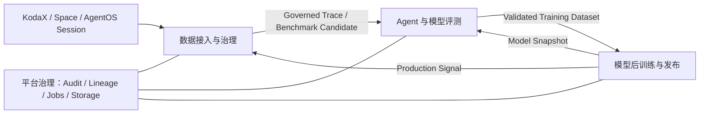

# TraceOps 三域平台架构

## 1. 架构目标

TraceOps 不再把 Session 接入、Harness 评测和训练数据导出作为一组平铺功能，而是建设成三个边界清晰、可独立深化的产品域：

1. 数据接入与治理（Data Access）
2. Agent 与模型评测（Evaluation）
3. 模型后训练与发布（Model Training）

三个域共用 Trace Lineage、审计、权限、任务编排、Segment Lake、Snapshot / Restore 等平台能力。

正式交付按版本逐步开放：v0.1.0 只开放数据接入与 Trace 治理；v0.2.0 加入评测；v0.3.0 再加入模型后训练与发布。仓库中提前存在的后续能力属于开发预览，不计入当前版本完成度。

## 2. 三个产品域

### 2.1 数据接入与治理

责任：把真实 Session 转换成可回放、可治理、可用于评测和训练的数据资产。

输入：KodaX、Space、AgentOS Session 和 Runtime 事件。

输出：Governed Trace、Evidence Chain、Validation Case Candidate、Versioned Dataset。

模块：

- D1 Session 数据接入
- D2 Trace 与 Evidence
- D3 预处理与数据治理
- D4 数据集版本

进入评测前必须满足最小契约：Lineage 完整、风险与用途完成标注、关键 Evidence 可验证。

### 2.2 Agent 与模型评测

责任：分别回答“工程师改的 Harness 是否变强”和“后训练后的模型是否变强”。

#### E1 Agent / Harness Eval

- 固定：Model、Runtime、Benchmark / Validation Suite
- 变量：Prompt、Context、Skill、Memory、Tool、Workflow 等 Harness H0/H1
- 输出：Harness Verdict、Case Churn、回归与成本变化

#### E2 Model Eval

- 固定：Harness、Runtime、Benchmark
- 变量：Model Snapshot
- 输出：Model Verdict、能力提升、回归、稳定性和成本变化

只有在目标能力提升、关键回归受控、泛化评测通过后，经验才可以晋升为训练数据候选。评测结果本身不直接等于训练数据。

### 2.3 模型后训练与发布

责任：消费已治理、已验证的数据集，生产新的 Model Snapshot，并安全交付到真实任务。

输入：Governed Training Dataset、Training Manifest、Model Baseline。

输出：Model Snapshot、Model Verdict、Released Model、Production Feedback。

模块：

- T1 模型后训练：训练交接、Provider Run、训练产物与 Lineage
- T2 模型发布：Model Eval 门禁、部署交接、版本与回滚
- T3 上线反馈闭环：线上监控、失败经验回流、下一轮评测与数据治理

## 3. 前端信息架构

首页提供三个一级域卡片，展示每个域的输入、输出、模块状态和实时指标。进入工作区后采用两级导航：

- 一级：数据接入 / 评测 / 模型后训练 / 平台治理
- 二级：当前产品域内部的 D1-D4、E1-E2 或 T1-T3 模块

这样可以先稳定大架构，再按产品优先级逐域深化，不需要继续在单一长页面里增加平铺模块。

## 4. 后端边界

`GET /api/platform/architecture` 是前后端共享的产品架构契约，返回三个产品域、模块状态、实时指标、跨域交付物、评测边界和平台基础能力。

`GET /api/platform/areas/:areaId/overview` 提供单一产品域 Overview。`areaId` 可取：

- `data_access`
- `evaluation`
- `model_training`

现有业务 API 按领域映射：

| 产品域 | 主要 API |
| --- | --- |
| 数据接入 | `/api/sources`、`/api/raw-traces`、`/api/clean-traces`、`/api/training-samples`、`/api/datasets` |
| 评测 | `/api/agent-eval`、`/api/eval-runs` |
| 模型后训练 | `/api/release-manifests`、`/api/retraining-handoffs`、`/api/training-runs`、`/api/model-release-gates`、`/api/deployment-handoffs`、`/api/feedback-loops` |
| 平台治理 | `/api/governance`、`/api/tasks`、`/api/system`、Segment Lake 与审计接口 |

后续代码拆分应按上述边界逐步把旧的集中式路由迁入领域 Router；迁移期间保持现有 URL 兼容，避免一次性破坏已有数据和 Demo 链路。

## 5. 深化顺序

1. 数据接入：补齐 Space / AgentOS Connector、自动筛选与数据质量可观测性。
2. Agent Eval：补齐泛化、OOD、历史回放、重复采样和置信度。
3. Model Eval：建立独立 Model Registry、Snapshot 对照和 Model × Harness 组合矩阵。
4. 后训练：接入真实训练 Provider、训练任务状态、产物登记和成本核算。
5. 发布闭环：Canary、Rollback、线上反馈回流和下一轮数据晋升。

每一步都应继续复用同一条 Trace / Dataset / Evaluation / Model Lineage，避免形成三个彼此孤立的系统。
